  

  
  
  
  
  

---

## 👨🏻‍💻 About Me

I'm a **Junior Manufacturing Systems Analyst** at [Colgate-Palmolive](https://www.colgatepalmolive.com.br/), working at the intersection of **software development, automation, data and industrial systems**.

I build applications, integrations, dashboards and intelligent automations that connect systems, reduce manual work and improve operational processes. I enjoy turning real challenges and new ideas into practical, scalable solutions.

- 🔭 Working with software, automation, data and industrial systems
- 🤖 Exploring LLMs, AI agents and RAG
- 🎓 Studying Systems Analysis and Development at USCS (expected July 2027)
- ⚡ Turning ideas into practical solutions

 

---

## 🧠 Skills & Technologies

### Languages

  

### Web, Backend & Mobile

  

### Data, Automation & Tools

  
  
  
  
  
  

  
  
  
  
  
  

---

## 📊 Mateus Melo GitHub Statistics

  

### Mateus Melo GitHub Activity Overview

  

  
  
  

  <b>Top Languages:</b> distribution by repositories · <b>Most Used Languages:</b> distribution by code volume

  
  

---

## 🐍 Mateus Melo GitHub Contribution Activity

  <picture>
    <source
      media="(prefers-color-scheme: dark)"
      srcset="https://mateusprogrid.github.io/mateusprogrid/github-contribution-grid-snake-dark.svg"
    />
    <source
      media="(prefers-color-scheme: light)"
      srcset="https://mateusprogrid.github.io/mateusprogrid/github-contribution-grid-snake.svg"
    />
    
  </picture>

